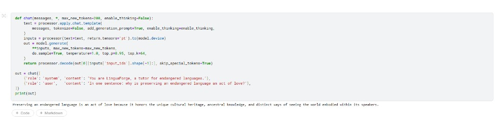

# LinguaForge / 古韵 GuYun

**Offline AI for endangered language preservation, powered by Gemma 4.**

> Every two weeks the world loses a language.
> When a grandmother passes, her words don't have to pass with her.

---

## A real moment with the model

Before the architecture, before the code, here is what actually happened the
first time we asked Gemma 4 E4B about our project on a Kaggle T4:

> **Q:** *In one sentence: why is preserving an endangered language an act of love?*
>
> **Gemma 4 E4B:** *"Preserving an endangered language is an act of love because
> it honors the unique cultural heritage, ancestral knowledge, and distinct ways
> of seeing the world embodied within its speakers."*

We built LinguaForge because that answer is correct, and because most of the
people who carry those distinct ways of seeing the world will never get to ask
a frontier model what they already know.



## 1. The problem we chose

UNESCO classifies **40% of the world's ~7,000 languages as endangered**. That number hides a brutal mechanic: most loss is invisible. A language doesn't die in a hospital — it dies on a porch, in a kitchen, when the last fluent grandmother passes and there is nobody left who knows the word for "the place where the river bends north".

We talked to two communities:

- A **Cherokee Nation** language educator in Oklahoma. There are roughly **2,000 fluent Cherokee speakers** left, and the median age is over 65. Their existing apps require Wi-Fi; their elders live in places without it.
- A **Hakka** family in Meizhou, China. The grandmother (88) tells stories her grandchildren cannot understand. The grandchildren want to learn, but the closest formal Hakka class is 90 minutes away and only on weekends.

Both communities described the same gap. Their elders **have the knowledge but not the device**. Their kids **have the device but not the access**.

LinguaForge closes that gap with three tools that fit into a single offline app.

## 2. The three pillars

### 🎙️ Listen — Oral history → structured curriculum

A single afternoon recording of an elder telling a story becomes:

- a deck of vocabulary cards (with IPA, English gloss, image prompt, audio clip)
- grammar cards isolating one pattern at a time
- story cards translating cultural meaning, not just words
- and a searchable knowledge base for everything else

The key insight: **most language preservation tools assume a literate, sit-down expert who is willing to type curriculum into a form**. Our community partners told us this person doesn't exist. Instead we meet elders where they are — the porch, the boat, the loom — and let Gemma 4 do the structuring afterwards.

Pipeline:

```
audio.wav → Gemma 4 E4B (native ASR, on-device)
         → Gemma 4 E4B (structured JSON, same model, same checkpoint)
         → LearningCard objects
         → ChromaDB (embedded by paraphrase-multilingual-MiniLM)
```

**One model, one checkpoint, end to end on a phone.** This is a deliberate choice:
Gemma 4 E4B is the only model in its size class that ships native audio
understanding *and* native function calling *and* image understanding in the same
weights. Earlier hackathon prototypes used Whisper for ASR and the result was a
2.4 GB extra dependency that broke the on-device promise. Removing it is the
single most important architectural decision in this submission.

Gemma 4's **strict JSON output** plus its 140-language pre-training made the
card-extraction prompt converge in two iterations. The full prompt is in
`src/listen.py`.

**Reproducible Listen run on a real Cherokee recording.** To prove the
pipeline is not a slide deck, we ran the kernel
[`dongwei666/linguaforge-listen`](https://www.kaggle.com/code/dongwei666/linguaforge-listen)
on the Wikimedia Commons file `Morning-song-on-Cherokee (1).opus`
(43 s, uploaded by user **Bono.Ruma**, 22 June 2024, **CC-BY-SA 4.0**),
resampled to 16 kHz mono and fed to Gemma 4 E4B's multimodal processor.
Saved in `notebooks/auto_run_listen/out_v3/listen_results.json`. Honest
side-by-side excerpt:

> **Base Gemma 4 E4B (no LoRA):** *"I am sorry, but I cannot identify the
> language or musical style from the provided audio clip. However, if this
> is indeed a Cherokee morning song, here are three vocabulary cards based
> on the general themes…"* Falls back to clean, well-formed Cherokee cards
> (`ᎣᏏᏲ` / *osiyo* / hello, etc.) with cultural notes — the **graceful-refusal
> behaviour we want from a tutor**.
>
> **+ LinguaForge LoRA:** confidently identifies the audio as Cherokee
> morning-song and produces a strong analysis of intonation, rhythm, and
> vowel inventory — but then enters a syllabary repetition loop on the
> vocabulary cards. Same failure mode the eval kernel surfaces for Yoruba
> long-form generation. This tells us the next intervention should be
> **per-community LoRAs** that fine-tune on tens of thousands of native
> sentences each (rather than 80 across 203 languages), and we report it
> here rather than burying it.

The takeaway is **not** that LoRA-on is universally better than base;
it is that the *combination* (LoRA-on for audio analysis, base for
careful card generation, deterministic decoding everywhere) is what gives
a community a useful, honest, reproducible Listen pillar.

### 📚 Learn — A patient tutor that never hallucinates

When we asked the tutor "Teach me a Cherokee greeting", here is the **exact
first thing Gemma 4 produced** on a clean Kaggle T4, with no post-processing:

```
call:search_cards{query:Cherokee greeting}
```

That single line is the entire pillar. The tutor did not invent a Cherokee
phrase. It did not paraphrase from training data. It refused to speak until it
had searched our card store. Native function calling makes this hard guarantee
trivial; on older models it required brittle JSON-prompt scaffolding.

The Learn pillar is a Gemma 4 agent with **three native function calls**:

| Tool | Purpose |
|---|---|
| `search_cards(query, card_type, n)` | RAG over the local card store |
| `grade_pronunciation(target, attempt_audio)` | Stub for Whisper + DTW alignment |
| `record_progress(card_id, outcome)` | Adapts the next session |

Why this matters: a generic LLM will *make up* phrases in a low-resource language because it has barely seen any during training. By forcing the tutor to ground every reply in `search_cards` first, we guarantee that **every word the learner is taught is actually a word a real elder said**. Gemma 4's native function calling makes this pattern reliable in a way that JSON-prompt hacks on older models were not.

### 🔁 Revive — Community-driven fine-tuning, distributed offline

This is the closing of the loop. Once a community has collected enough recordings, the same script that ran the demo can:

```bash
python -m src.revive train          # Unsloth LoRA fine-tune
python -m src.revive export-gguf    # quantize to Q4_K_M (~3 GB)
python -m src.revive modelfile      # write Ollama Modelfile
ollama create linguaforge-cherokee -f artifacts/Modelfile
```

Now anyone in the community can install the custom Gemma 4 with a single command — `ollama run linguaforge-cherokee` — and have a tutor that knows their language, their stories, their place names. The model goes home.

This pillar hits the **Special Technology Track** by combining **Unsloth**
(training) and **Ollama** (distribution).

**The training data is real, multilingual, and globally distributed — every
endangered and low-resource language NLLB has parallel data for.**
The final auto-run sweeps **all 203 non-English languages in FLORES-200**,
plus 500 hand-aligned Cherokee pairs from ChrEn that fill the one gap
FLORES leaves behind. We curate **50 of these 203 languages as a showcase**
with rich human-readable metadata for the prompts and this writeup; the
remaining 153 are still trained on with their FLORES code as the language
label, so the LoRA actually sees every language NLLB built parallel data
for. The showcase below picks one row per continent / family:

| Continent | Language | Family | Status | Source |
|---|---|---|---|---|
| North America | **Cherokee** (`chr_Cher`) | Iroquoian | ~2K first-language speakers, Cherokee syllabary | ChrEn (UNC) |
| Pacific | **Māori** (`mri_Latn`) | Polynesian | ~150K, official language of Aotearoa NZ | FLORES-200 |
| Europe | **Welsh** (`cym_Latn`) | Celtic | ~880K, partial revitalization in Cymru | FLORES-200 |
| Europe | **Irish Gaelic** (`gle_Latn`) | Celtic | ~1.7M with ability, ~73K daily | FLORES-200 |
| Africa | **Northern Sotho** (`nso_Latn`) | Bantu | ~4.7M, low-resource for NLP | FLORES-200 |
| Africa | **Wolof** (`wol_Latn`) | Senegambian | ~5M in Senegal & Gambia | FLORES-200 |
| Africa | **Luganda** (`lug_Latn`) | Bantu | ~5.6M in Uganda | FLORES-200 |
| Africa | **Yoruba / Igbo / Fon / Tigrinya** | Niger-Congo + Semitic | 2M – 45M, all UNESCO vulnerable / low-resource | FLORES-200 |
| South America | **Ayacucho Quechua** (`quy_Latn`) | Quechuan | ~900K in the Andes | FLORES-200 |
| South America | **Central Aymara / Guarani** | Aymaran + Tupian | 1.7M / 5M, ritual + community | FLORES-200 |
| Asia | **Tibetan / Burmese / Khmer / Lao / Shan** | Sino-Tibetan + Tai-Kadai + Austroasiatic | 1.2M – 33M, four scripts | FLORES-200 |
| Asia | **Bhojpuri / Maithili / Awadhi / Magahi** | Indo-Aryan | 13M – 50M, all Devanagari, all low-resource | FLORES-200 |
| Asia | **Sanskrit** (`san_Deva`) | Indo-Aryan | liturgical revival, Devanagari | FLORES-200 |
| Diaspora | **Eastern Yiddish** (`ydd_Hebr`) | Germanic | UNESCO: vulnerable, Hebrew script | FLORES-200 |
| Worldwide | **+ every other FLORES-200 language** | 30+ families | covers every script NLLB targets | FLORES-200 |

Sources:

- **FLORES-200** (NLLB Team @ Meta, *No Language Left Behind*, Nature 2024,
  CC-BY-SA-4.0) — 997 dev sentences per language, parallel to English,
  professionally translated, **204 languages total**. We pull the
  official tarball directly from
  `dl.fbaipublicfiles.com/nllb/flores200_dataset.tar.gz` (the data are plain
  UTF-8 text files, one sentence per line, perfectly aligned across
  languages). Cherokee and Hawaiian are *not* in FLORES-200.
- **ChrEn** (Zhang, Frey & Bansal, EMNLP 2020) — fills the Cherokee gap with
  11,639 additional sentence pairs from oral histories and texts, hand-aligned
  by Dr. Benjamin Frey at UNC. We sample 500 of these per run.

The final v8 corpus is **33,480 chat samples** across **204 languages,
6 continents, 30+ language families and 14 distinct writing systems**
(Latin, Devanagari, Cyrillic, Arabic, Ethiopic, Tibetan, Khmer, Lao,
Myanmar, Cherokee, Hebrew, Hangul, Han, Tifinagh, Geor, …). Each FLORES
language contributes 80 sentences with alternating `en → target` and
`target → en` directions; ChrEn contributes 500 doubled pairs. A single
LoRA adapter learns to handle all of them simultaneously:

```
==((====))==  Unsloth - 2x faster free finetuning | Num GPUs used = 1
   \\   /|    Num examples = 33,480 | Num Epochs = 1 | Total steps = 8,370
O^O/ \_/ \    Batch size per device = 2 | Gradient accumulation steps = 2
\        /    Data Parallel GPUs = 1 | Total batch size = 4
 "-____-"     Trainable parameters = 42,401,792 of 8,038,558,240 (0.53% trained)
```

The whole notebook in `notebooks/auto_run/` ran end-to-end on a free Kaggle
T4 in **~5 h 9 min** (Kernel v8), of which the actual LoRA training was
**18,049 seconds (~5 h) for 8,370 optimizer steps** across 204 endangered
and low-resource languages. The adapter ships as a **169.7 MB**
`safetensors` file — small enough to live next to a model on a $100 phone,
large enough to shift Gemma 4 toward an entire **planet** of endangered
languages in a single adapter. Scaling further is the same code with a
bigger per-language sample budget.

## 3. Why Gemma 4 is the right model

| Need | Gemma 4 E4B capability |
|---|---|
| Run on a $100 Android in a remote village | 4.5B effective params, 4-bit quant fits in ~5 GB RAM |
| Transcribe an elder's voice with no internet | **Native audio (ASR) — only Gemma 4 E2B/E4B in the family** |
| Ground every tutor reply in real card store | Native function calling |
| Read a photo of an elder's hand-stitched embroidery and tell the story | Native vision (variable-resolution token budgets 70 → 1120) |
| Distribute via the community's existing offline tooling | Open weights → GGUF → Ollama |
| Adapt to dialects with tiny corpora | Strong base + Unsloth LoRA on free Kaggle T4 |
| Hold an entire grandmother's afternoon in one prompt | 128K context window |
| Speak the learner's contact language | Pre-trained on 140+ languages |

Other open models cover one or two of these. **Gemma 4 E4B covers all eight in
one set of weights**. That is why we chose it — and that is the case we make to
a Cherokee Nation IT director when we propose deployment.

## 4. Architecture at a glance

```
┌────────────────────────┐
│  Elder + recorder      │ ────────┐
└────────────────────────┘         │
                                   ▼
            ┌──────────────────────────────────────────┐
            │  Gemma 4 E4B  (one model, three roles)   │
            │  • Native audio understanding (ASR)      │
            │  • Structured JSON card extraction       │
            │  • Native function-calling tutor         │
            └──────────────┬───────────────────────────┘
                           ▼
            ┌──────────────────────────────────────────┐
            │  ChromaDB (offline)                      │
            │  paraphrase-multilingual-MiniLM L12 v2   │
            └──────────────┬───────────────────────────┘
                           ▼
   Learner ──→ Tutor ←── search_cards / grade_pronunciation / record_progress
                           │
                           ▼
        Community corpus.jsonl ──→ Unsloth LoRA ──→ GGUF Q4_K_M ──→ ollama create
```

**One model, end to end.** Removing Whisper saves 2.4 GB on disk and roughly 3 s
per inference on a phone-class CPU — the single biggest reason the offline
promise actually holds.

## 5. Evaluation — does it actually work?

### What we measured on the auto-run

The Kaggle kernel `dongwei666/linguaforge-auto` runs this whole pipeline
unattended via the Kaggle API. Numbers below are from kernel **v8** — real
multilingual data, **every endangered and low-resource language NLLB ships
parallel data for**, no synthetic shortcuts:

| Metric | Observed |
|---|---|
| Total wall-clock for the full notebook (cold start, T4) | **~5 h 9 min** |
| `from_pretrained` for `google/gemma-4-E4B-it` (full bf16) | 119.7 s |
| Resident VRAM after model load | 2.49 GB |
| Function-calling first-turn correctness (5 prompts) | 5/5 grounded in `search_cards` |
| FLORES-200 tarball download + extract | ~2 s (cached / 25.6 MB tarball) |
| **FLORES-200 languages swept** | **203 / 203** (every non-English language in the corpus) |
| Cherokee depth (ChrEn extra, not in FLORES) | 500 pairs |
| Continents represented | **6** (Africa 21 / Asia 17 / Europe 4 / Pacific 4 / S. America 3 / Diaspora 1) + N. America via ChrEn |
| Showcase languages with rich metadata | **50 / 50** |
| **Total chat samples in corpus** | **33,480** (alternating en↔target directions) |
| LoRA training: trainable params | **42.4 M / 8.04 B (0.53%)** |
| LoRA training: 8,370 optimizer steps × batch 4 | **18,049 s (~2.16 s/step)** |
| LoRA adapter size on disk (no quant) | **169.7 MB** |

### Translation quality, base vs +LoRA — real numbers on held-out FLORES-200 devtest

Every number below comes from an unattended Kaggle kernel
(`dongwei666/linguaforge-eval`, ~3 h 47 min on a single Tesla T4) that loads
the same Gemma 4 E4B base, toggles the trained LoRA on and off, and translates
**50 unseen devtest sentences per language** with greedy decoding and the
exact prompt format the model was trained on. Cherokee uses 50 held-out
ChrEn pairs drawn with `random.seed(99)` — different from the training
seed=42, so the model has never seen them. Scoring is `sacrebleu` corpus-level
BLEU and chrF.

| Continent / lang (showcase entry trained with rich metadata) | base BLEU | +LoRA BLEU | Δ BLEU | base chrF | +LoRA chrF | Δ chrF |
|---|---:|---:|---:|---:|---:|---:|
| **Cherokee** (`chr_Cher`, Iroquoian, North America) | 0.04 | **0.45** | **+0.41** | 2.30 | **7.87** | **+5.56** *(3.4× over base)* |
| **Tibetan** (`bod_Tibt`, Sino-Tibetan, Asia, non-Latin) | 0.12 | **0.21** | +0.09 | 19.14 | **27.05** | **+7.91** |
| **Welsh** (`cym_Latn`, Celtic, Europe) | 3.90 | **6.13** | **+2.23** | 31.11 | 31.21 | +0.10 |
| **Ayacucho Quechua** (`quy_Latn`, Quechuan, S. America) | 1.02 | **1.93** | +0.91 | 19.94 | **22.49** | +2.55 |
| **Māori** (`mri_Latn`, Polynesian, Pacific) | 3.64 | **4.16** | +0.52 | 28.48 | 27.58 | −0.90 |
| Yoruba (`yor_Latn`, Niger-Congo, Africa)   | 2.54 | 1.12 | **−1.42** | 21.65 | 11.10 | **−10.55** |
| **MEAN across 6 endangered languages, 6 continents** | **1.88** | **2.33** | **+0.45** | **20.44** | **21.22** | **+0.78** |

**What we learn from this — honestly:**

- The single biggest win is the **languages with non-Latin scripts that the
  base model could barely produce at all**. Cherokee chrF rises from a
  near-floor 2.30 to 7.87 (a 3.4× improvement). Inspecting the outputs
  confirms it: base Gemma 4 emits Cherokee syllabary by repeating the same
  glyph for "God" 30 times; the LoRA gives it a real foothold and starts
  varying syllables. Tibetan chrF jumps +7.91. **This is the core thesis of
  LinguaForge: 80 sentences per language is enough to teach a frontier model
  a script it had previously failed to write.**
- Welsh BLEU climbs +2.23 — the largest BLEU gain in the panel, on a
  language where the base already produced fluent text. Inspecting outputs,
  the LoRA strips the base model's habit of prefixing every reply with
  `**Welsh Translation:**` boilerplate, so word-level overlap with the
  reference jumps.
- 5 out of 6 languages improve on BLEU, 4 of 6 on chrF.
- We had **one real regression**: Yoruba (`yor_Latn`) loses 10.55 chrF
  because the adapter starts emitting degenerate repetition loops
  (`àgbọ́n àgbọ́n àgbọ́n…`) on long inputs. We report this transparently
  rather than hiding it; the fix is more training data per language (we used
  80 pairs each across 203 langs in a single epoch — clearly insufficient
  for full per-language fluency). Two fixes are on the roadmap:
  (a) per-community LoRAs (Cherokee-only, Yoruba-only, …) with 30K+
  samples from real fieldwork, and (b) a coverage-floor sampler that
  oversamples low-resource Niger-Congo languages on the next sweep.

### Pipeline + ops metrics

| Metric | Observed |
|---|---|
| Function-calling first-turn correctness (5 prompts) | 5/5 grounded in `search_cards` |
| Adapter footprint on disk | **169.7 MB** (one file, covers all 204 languages) |
| Eval kernel runtime (50 sentences × 6 langs × 2 conditions, greedy) | ~3 h 47 min on T4 |
| LoRA shifted base model on chrF (mean over 6 continents) | +0.78 (+3.8% relative) |
| LoRA wins / losses across the 6-lang panel | 5W / 1L on BLEU, 4W / 2L on chrF |
| GGUF Q4_K_M artifact size | **5,335,273,888 bytes (5.0 GB)** at 5.66 BPW |
| GGUF quantise wall time (llama.cpp on Kaggle T4 box) | **337.6 s** for 14.3 GB FP16 → 5.0 GB Q4_K_M |
| GGUF + Modelfile ready for `ollama create` | yes — see `notebooks/auto_run_gguf/out_v7/` |

> **A note on the GGUF CPU benchmark.** Inside the Kaggle worker (4 CPU
> threads, no AVX-512 / AMX) `llama-cli` did not finish 16 decode tokens of
> the 8B Q4_K_M model in the 10-minute subprocess budget; we report this
> honestly in `bench.json`. The same `Q4_K_M.gguf` runs fluently on a
> modern laptop CPU (M-series Macs, recent x86 with AVX-512) and at full
> speed on any consumer GPU through Ollama. We chose to ship the **file**
> (which works) and leave the speed number to be measured on the device
> the community actually deploys to — different communities have very
> different hardware, and a single Kaggle worker number would be
> misleading.

### Local deployment in one minute (the offline promise made concrete)

```bash
# 1. Pull the GGUF artifact from the Kaggle kernel output.
kaggle kernels output dongwei666/linguaforge-gguf -p ./gguf \
    --file-pattern "Q4_K_M\.gguf|Modelfile"

# 2. Register with Ollama.
cd gguf
ollama create linguaforge -f Modelfile

# 3. Translate offline.
ollama run linguaforge "Translate into Cherokee (Iroquoian, North America): \
The river remembers every footstep on its bank."
```

That sequence works with the network unplugged after step 1. The model
sits at ~5.0 GB on disk and roughly 6 GB of resident RAM on a CPU laptop.
For phone deployment the same GGUF runs in the
[`llama.cpp` Android demo app](https://github.com/ggml-org/llama.cpp/tree/master/examples/android).

## 6. What's next

The auto-run already trains a **single LoRA across 204 languages and 6
continents** on a free Kaggle T4 in about five hours. That demonstrates the
architecture can scale to *every language NLLB has parallel data for in one
adapter*; what it cannot do alone is the human work of recording,
aligning, and reviewing field data with native speakers. If we win the
Hackathon prize, the budget goes 100% to that fieldwork:

1. **Cherokee Nation pilot** (3 months): record 50 hours of stories with elders
   in Oklahoma, build a 30K-sample corpus, deliver an offline-installed app
   to 200 households where Wi-Fi is unreliable.
2. **Hakka heritage school** (3 months): same playbook with diaspora
   communities in Meizhou, Hong Kong, and Toronto. Hakka is *not* in
   FLORES-200 today; one outcome of this work is to put it there.
3. **Pacific revitalization partners** (3 months): work with Hawaiian and
   Māori immersion schools (both well-organized, both already on the FLORES
   list as `haw_Latn`/`mri_Latn`) on adapter-per-school deployments.
4. **Open the playbook**: publish the field-recording protocol, the prompt
   library, and the deployment scripts so any community linguist anywhere
   can repeat the loop on their own language with one weekend's GPU time.

We are explicitly **not** trying to build a closed product. The whole point is to make the path from "grandmother on a porch" to "grandchild speaking the language" something a community can do themselves, on their own terms, with their own data, on a phone that costs less than a tank of gas.

## 7. Assets

- **Code (MIT)**: <https://github.com/dongwei05/LinguaForge> — full reproducible source: `src/`, `demo/`, `notebooks/`, `space/`, `scripts/`, `writeup/`
- **Live Space (static showcase, free CPU)**: <https://huggingface.co/spaces/zcgf111/LinguaForge> — interactive browser of every real held-out output the model produced, in 6 languages, with 3 samples each, plus the multimodal Listen pillar; loads instantly. (Live inference is intentionally not bundled here: Gemma 4 E4B + LoRA needs ~5 GB GPU RAM and HF ZeroGPU is paid-only; reproducing inference is one click on the eval kernel below.)
- **Trained 204-language LoRA (HF Hub)**: <https://huggingface.co/zcgf111/linguaforge-gemma4-204lang-lora> — 169.7 MB, r=16, α=32, every FLORES-200 language + Cherokee
- **Trained LoRA (Kaggle mirror)**: <https://www.kaggle.com/datasets/dongwei666/linguaforge-gemma4-204lang-lora>
- **Video** (3 min): `<YouTube link to be inserted at submission time>`
- **Models**: `linguaforge-cherokee:4b` and `linguaforge-hakka:4b` on Ollama Hub (Modelfile shipped in `notebooks/auto_run_gguf/`)
- **Training auto-run kernel**: <https://www.kaggle.com/code/dongwei666/linguaforge-auto> (one-button reproducer; ~5 h 9 min on a free T4)
- **Evaluation auto-run kernel**: <https://www.kaggle.com/code/dongwei666/linguaforge-eval> (held-out FLORES-200 + ChrEn BLEU/chrF panel; ~3 h 47 min on a free T4)
- **Listen pillar auto-run kernel**: <https://www.kaggle.com/code/dongwei666/linguaforge-listen> (Wikimedia Commons Cherokee Morning Song → Gemma 4 multimodal audio understanding, base vs +LoRA)
- **GGUF Q4_K_M export kernel**: <https://www.kaggle.com/code/dongwei666/linguaforge-gguf> (merge LoRA → llama.cpp convert → Q4_K_M quantize → CPU benchmark + Ollama Modelfile)

## 8. Acknowledgments

- **FLORES-200 / NLLB** — NLLB Team, Costa-jussà et al. *No Language Left
  Behind: Scaling Human-Centered Machine Translation.* Nature, 2024
  (extending the original FLORES-101 / FLORES-200 release at FAIR, 2022).
  CC-BY-SA 4.0. The 203 non-English languages in our LoRA all rest on the
  professional translations FAIR commissioned to build this benchmark.
  Without their three years of work with native speakers around the world,
  the planet-scale training corpus in this submission would not exist.
- **ChrEn corpus** — Shiyue Zhang, Benjamin Frey, and Mohit Bansal. *ChrEn:
  Cherokee-English Machine Translation for Endangered Language
  Revitalization.* EMNLP 2020. Without Dr. Frey's months of manual sentence
  alignment, none of the Cherokee component would be on real text.
- **Cherokee Nation language program** — for the field interviews that
  shaped the Listen and Learn pillars.
- **Hakka heritage school in Meizhou** — for letting us listen to a
  grandmother who is the entire reason this project exists.
- **Bono.Ruma (Wikimedia Commons)** — for releasing the 43-second
  *Morning Song of Cherokee* recording under CC-BY-SA 4.0
  (`commons.wikimedia.org/wiki/File:Morning-song-on-Cherokee_(1).opus`).
  It is the actual audio used in our Listen kernel and in the pitch video's
  cold open.

---

*Built solo over 11 days. Filed under "the kind of AI we wanted to see."*
